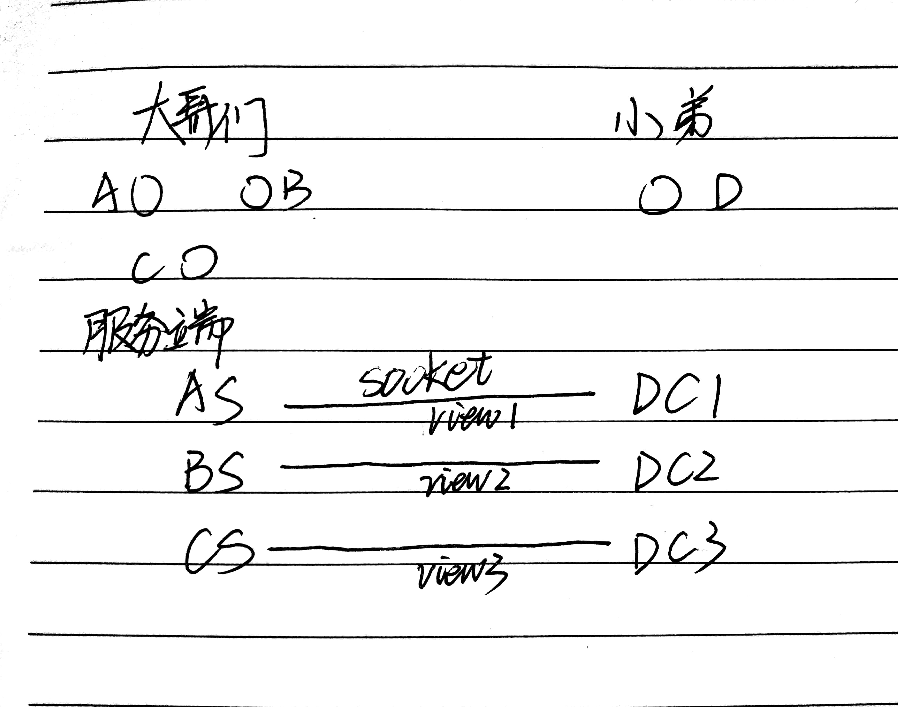
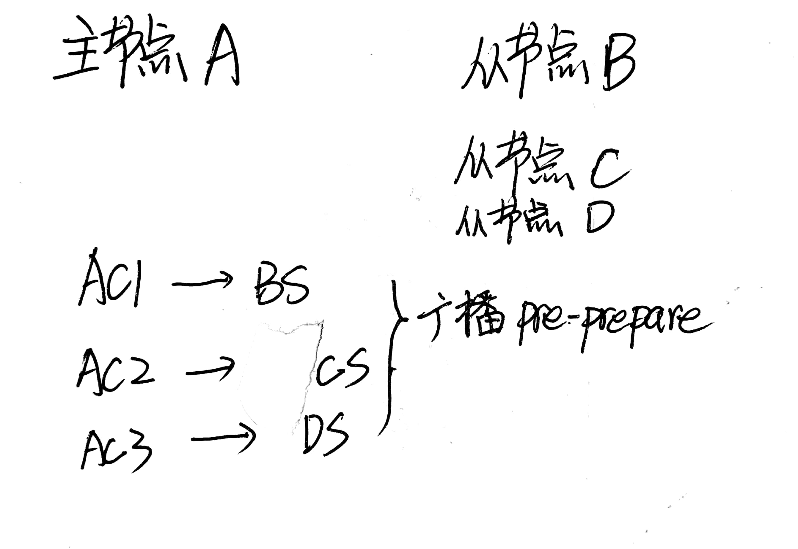
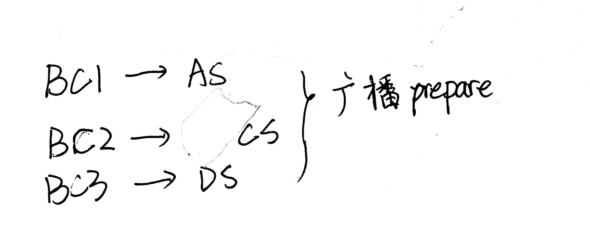
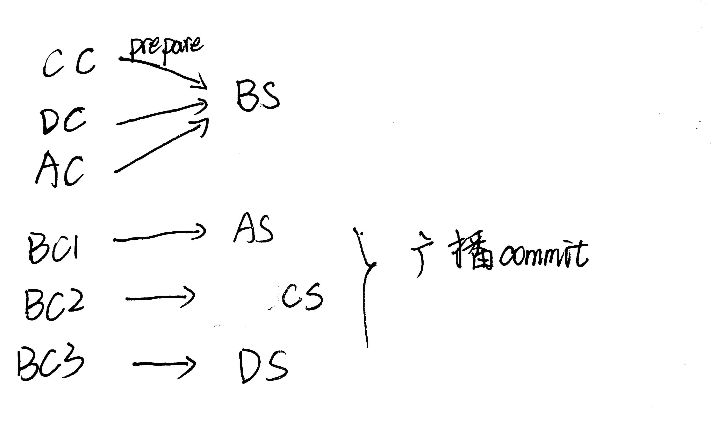
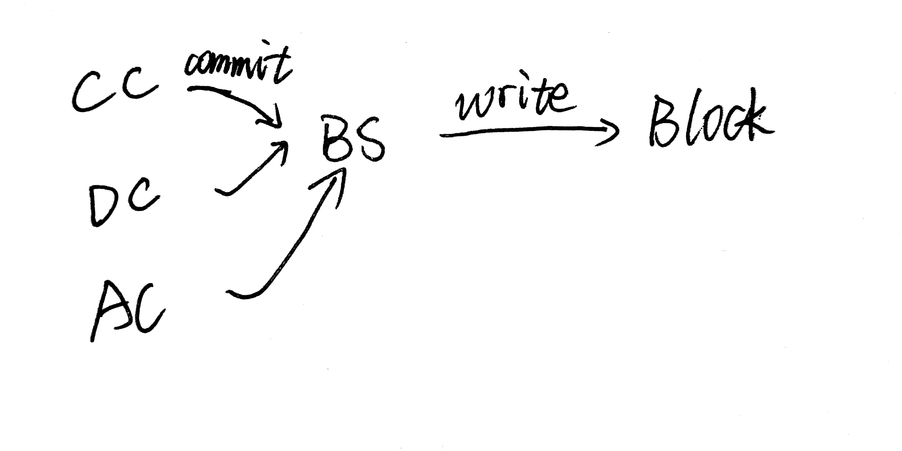

## PBFT 算法的java实现（上）

在这篇博客中，我会通过Java 去实现PBFT中结点的加入，以及认证。其中使用socket实现网络信息传输。

关于PBFT算法的一些介绍，大家可以去看一看网上的博客，也可以参考我的上上一篇[博客](https://www.cnblogs.com/xiaohuiduan/p/12210891.html)，关于怎么构建P2P网络可以参考我的上一篇[博客](https://www.cnblogs.com/xiaohuiduan/p/12302024.html)。

该项目的地址：[GitHub](https://github.com/xiaohuiduan/pbft)

### 使用前的准备

使用maven构建项目，当然，也可以不使用，这个就看自己的想法吧。

需要使用到的Java包：

- t-io：使用t-io进行网络socket通信，emm，这个框架的文档需要收费（699RMB），但是这里我们只是简单的使用，不需要使用到其中很复杂的功能。
- fastjson：Json 数据解析
- lombok：快速的get，set以及toString
- hutool：万一要用到呢？
- lombok：节省代码
- log4j：日志
- guava：Google的一些并发包

### 结点的数据结构

首先的首先，我们需要来定义一下结点的数据结构。

首先是结点Node的数据结构：

```java
@Data
public class Node extends NodeBasicInfo{

    /**
     * 单例设计模式
     * @return
     */
    public static Node getInstance(){
        return node;
    }
    private Node(){}
    
    private static Node node = new Node();

    /**
     * 判断结点是否运行
     */
    private boolean isRun = false;

    /**
     * 视图状态，判断是否ok，
     */
    private volatile boolean viewOK;
}

@Data
public class NodeBasicInfo {
    /**
     * 结点地址的信息
     */
    private NodeAddress address;
    /**
     * 这个代表了结点的序号
     */
    private int index;

}

@Data
public class NodeAddress {
    /**
     * ip地址
     */
    private String ip;
    /**
     * 通信地址的端口号
     */
    private int port;

}

```

> 上面的代码看起来有点多，但实际上很少（上面是3个类，为了展示，我把它们放在了一起）。上面定义了Node应该包含的属性信息：ip，端口，序列号index，view是否ok。

结点的信息很简单。接下来我们就可以看一看PbftMsg的数据结构了。PbftMsg代表的是进行Pbft算法发送信息的数据结构。

```java
@Data
public class PbftMsg {
    /**
     * 消息类型
     */
    private int msgType;

    /**
     * 消息体
     */
    private String body;

    /**
     * 消息发起的结点编号
     */
    private int node;

    /**
     * 消息发送的目的地
     */
    private int toNode;

    /**
     * 消息时间戳
     */
    private long time;

    /**
     * 检测是否通过
     */
    private boolean isOk;

    /**
     * 结点视图
     */
    private int viewNum;

    /**
     * 使用UUID进行生成
     */
    private String id;

    private PbftMsg() {
    }

    public PbftMsg(int msgType, int node) {
        this.msgType = msgType;
        this.node = node;
        this.time = System.currentTimeMillis();
        this.id = IdUtil.randomUUID();
        this.viewNum = AllNodeCommonMsg.view;
    }

    @Override
    public boolean equals(Object o) {
        if (this == o) {
            return true;
        }
        if (o == null || getClass() != o.getClass()) {
            return false;
        }
        PbftMsg msg = (PbftMsg) o;
        return node == msg.node &&
                time == msg.time &&
                viewNum == msg.viewNum &&
                body.equals(msg.body) &&
                id.equals(msg.id);
    }

    @Override
    public int hashCode() {
        return Objects.hash(body, node, time, viewNum, id);
    }
}
```

> PBFTMSG这里我只是简单的定义了一下，并不是很严谨。在这里主要说下重要的属性：
>
> msgType代表的是Pbft算法的消息类型，因为pbft算法有不同类型的请求消息。

同样，我们需要保存一些状态数据：

```java
public class AllNodeCommonMsg {
    /**
     * 获得最大失效结点的数量
     *
     * @return
     */
    public static int getMaxf() {
        return (size - 1) / 3;
    }

    /**
     * 获得主节点的index序号
     *
     * @return
     */
    public static int getPriIndex() {
        return (view + 1) % size;
    }

    /**
     * 保存结点对应的ip地址和端口号
     */
    public static ConcurrentHashMap<Integer, NodeBasicInfo> allNodeAddressMap = new ConcurrentHashMap<>(2 << 10) ;

    /**
     * view的值，0代表view未被初始化
     * 当前视图的编号，通过这个编号可以算出主节点的序号
     */
    public volatile static int view = 0;
    /**
     * 区块链中结点的总结点数
     */
    public static int size = allNodeAddressMap.size()+1;
}

```


### 逻辑流程

上面的定义看一看就行了，在这里我们主要是理解好PBFT算法的流程。在下面我们将好好的分析一下PBFT算法的流程。

合抱之木始于毫末,万丈高楼起于垒土。所有所有的开始，我们都需要从节点的加入开始说起。

在前前面的[博客](https://www.cnblogs.com/xiaohuiduan/p/12210891.html)，我们知道一个在PBFT算法中有一个主节点，那么主节点是怎么出来的呢？当然是通过view算出来的。

设：结点数为N，当前视图为view，则主结点的id为：

$$primaryId = (view +1) mod N$$

因此，当一个节点启动的时候，他肯定是迷茫的，不知道自己是谁，这个时候就需要找一个节点问问目前是什么情况，问谁呢？肯定是问主节点，但是主节点是谁呢？在区块链中的节点当然都知道主节点是谁。这个时候，新启动的节点（姑且称之为小弟）就会向所有的节点去询问：大哥们，你们的view是多大啊，能不能行行好告诉小弟我！然后大哥们会将自己的view告诉小弟。但是小弟又担心大哥们骗他给他错误的view，所以决定当返回的view满足一定的数量的时候，就决定使用该view。

那么这个一定数量是多少呢？

> quorum：达到共识需要的结点数量 $quorum = \lceil \frac {N + f +1 }{2 }\rceil $

说了这么多理论方面的东西，现在让我们来讲一讲代码方面是怎么考虑。

定义好两个简单的数据结构，我们就可以来想一想Pbft算法的流程了。

### 代码流程

首先的首先，我们先定义：节点的序号从0开始，view也从0开始，当然这个时候size肯定不是0，是1。so，主节点的序号是$primaryId = (0+1)%1 = 0$。

既然我们使用socket通信，使用的是t-io框架。我们就从服务端和客户端的方面来理解这个view的获取过程。神笔马良来了！！



这个从socket的角度的解释下过程。

首先区块链中的节点作为服务端，新加入的节点叫做客户端（遵循哲学态度，client发送请求询问server）。因为有多个server，因此对于`D节点`来说，就需要多个客户端分别对应不同的服务端发送请求。然后服务端将view返回给client。

然后说下代码，服务端接受到client发送的请求后，就将自己的view返回给client，然后client根据view的num决定哪一个才是真正的view。这里可以分为3个步骤：客户端请求view，服务端返回view，客户端处理view。

客户端请求view：

```java
    /**
     * 发送view请求
     *
     * @return
     */
    public boolean pubView() {
        log.info("结点开始进行view同步操作");
        // 初始化view的msg
        PbftMsg view = new PbftMsg(MsgType.GET_VIEW, node.getIndex());
        // 将消息进行广播
        ClientUtil.clientPublish(view);
        return true;
    }

```

上面的代码很简单，就是客户端向服务端广播PbftMsg，然后该消息的类型是GET_VIEW类型（也就是告诉大哥们，我是来请求view的）。

既然客户端广播了PBFT消息，当然服务端就会接受到。

下面是server端的代码，至于服务端是怎么接收到的，参考我的上一篇[博客](https://www.cnblogs.com/xiaohuiduan/p/12302024.html)，或者别人的博客。当服务端接受到view的请求消息后，就会将自己的view发送给client。

```java
    /**
     * 将自己的view发送给client
     *
     * @param channelContext
     * @param msg
     */
    private void onGetView(ChannelContext channelContext, PbftMsg msg) {
        log.info("server结点回复视图请求操作");
        int fromNode = msg.getNode();
        // 设置消息的发送方
        msg.setNode(node.getIndex());
        // 设置消息的目的地
        msg.setToNode(fromNode);
        // 设置消息的view
        msg.setViewNum(AllNodeCommonMsg.view);
        String jsonView = JSON.toJSONString(msg);
        MsgPacket msgPacket = new MsgPacket();
        try {
            msgPacket.setBody(jsonView.getBytes(MsgPacket.CHARSET));
            // 将消息发送给client
            Tio.send(channelContext, msgPacket);
        } catch (UnsupportedEncodingException e) {
            log.error(String.format("server结点发送view消息失败%s", e.getMessage()));
        }
    }
```

然后是client接受到server返回的消息，然后进行处理。

```java
    /**
     * 获得view
     *
     * @param msg
     */
    private void getView(PbftMsg msg) {
        // 如果节点的view好了，当然也就不要下面的处理了
        if (node.isViewOK()) {
            return;
        }
        // count代表有多少位大哥返回该view
        long count = collection.getViewNumCount().incrementAndGet(msg.getViewNum());
        // count >= 2 * AllNodeCommonMsg.getMaxf()则代表该view 可以
        if (count >= 2 * AllNodeCommonMsg.getMaxf() + 1 && !node.isViewOK()) {
            collection.getViewNumCount().clear();
            node.setViewOK(true);
            AllNodeCommonMsg.view = msg.getViewNum();
            log.info("视图初始化完成OK");
        }
    }
```

> 在这里大家可能会发现一个问题，我在第二个if中还是使用了`!node.isViewOK()`。那是因为我发现在多线程的情况下，即使view设置为true了，下面的代码还是会执行，也就是说`log.info("视图初始化完成OK");`会执行两次，因此我又加了一个view检测。

同样，我们可以来实现一下视图变更（ViewChange）的算法。

什么时候会产生viewChange呢？当然是主节点失效的时候，就会进行viewchange的执行。当某一个节点发现主节点失效时（也即是断开连接的时候），他就会告诉所有的节点（进行广播）：啊！！不好了，主节点GG了，让我们重新选择一个主节点吧。因此，当节点收到quorum个重新选举节点的消息时，他就会将改变自己的视图。

这里有一个前提，就是当主节点和客户端断开的时候，客户端会察觉到。

client的代码：

重新选举view就是将目前的veiw+1，然后讲该view广播出去。

```java
    /**
     * 发送重新选举的消息
     * 这个onChangeView是通过其它函数调用的，msg的内容如下所示
     *  PbftMsg msg = new PbftMsg(MsgType.CHANGE_VIEW,node.getIndex());
     */
    private void onChangeView(PbftMsg msg) {
        // view进行加1处理
        int viewNum = AllNodeCommonMsg.view + 1;
        msg.setViewNum(viewNum);
        ClientUtil.clientPublish(msg);
    }
```

服务端代码：

服务端代码和前面的的代码很类似。

```java
    /**
     * 重新设置view
     *
     * @param channelContext
     * @param msg
     */
    private void changeView(ChannelContext channelContext, PbftMsg msg) {
        if (node.isViewOK()) {
            return;
        }
        long count = collection.getViewNumCount().incrementAndGet(msg.getViewNum());

        if (count >= 2 * AllNodeCommonMsg.getMaxf() + 1 && !node.isViewOK()) {
            collection.getViewNumCount().clear();
            node.setViewOK(true);
            AllNodeCommonMsg.view = msg.getViewNum();
            log.info("视图变更完成OK");
        }
    }
```

### 总结

在这里，大家可能会有个疑惑，为什么进行广播消息不是使用服务端去广播消息，反而是使用client一个一个的去广播消息。原因有一下两点：

- 因为没有购买t-io文档，因此我也不知道server怎么进行广播消息。因为它取消了学生优惠，现在需要699￥，实在是太贵了（当然这个贵是针对与我而言的，不过这个框架还是真的挺好用的）舍不得买。

- 为了是思路清晰，client就是为了请求数据，而server就是为了返回数据。这样想的时候，不会是自己的思路断掉

在这里为止，我们就简单的实现了节点加入和view的变迁（当然是最简单的实现，emm，大佬勿喷）。在下篇博客中，我将会介绍共识过程的实现。如果这篇博客有错误的地方，望大佬指正。可以在评论区留言或者邮箱联系。

项目地址：[GitHub](https://github.com/xiaohuiduan/pbft)

## PBFT 算法的java实现（下）

在上一篇[博客](https://www.cnblogs.com/xiaohuiduan/p/12339955.html)中（如果没有看上一篇博客建议去看上一篇博客），我们介绍了使用Java实现PBFT算法中节点的加入，view的同步等操作。在这篇博客中，我将介绍PBFT算法中共识过程的实现。

项目地址：[GitHub](https://github.com/xiaohuiduan/pbft)

### 共识过程

这个是[hyperchain](https://hyperchain.readthedocs.io/zh_CN/latest/consensus.html#id4)的官方图，展示的是一个RBFT常规流程。如果想了解更多，可以去参考hyperchain官网，或者我以前的[博客](https://www.cnblogs.com/xiaohuiduan/p/12210891.html)。


在共识的过程一共有3个阶段：PrePrepare，prepare，commit。上面的图介绍的还是比较简单明了的。下面将用通俗的语言来介绍这个过程。

我们设想一个场景，我们生活在一个村子里面，每一个人都有着自己的小本本，小本本上面记录着这个村子里面的所有的支出。某一天村子支出了100￥，然后村长（主节点）将这个支出消息进行广播，广播的消息类型是preprepare。村子中的村民收到这个消息后，肯定会看看村子里面是不是真的支出了100￥，如果消息是真的的话就告诉其他的村民村子里面是真的支出了100￥（消息类型是prepare）。当一个村名接收到$quorum = \lceil \frac {N + f +1 }{2 }\rceil $数量的prepare消息，就认为这个消息是真的消息（当然实际上的情况会更复杂），然后向外广播我同意（commit）这份支出写入账本，当一个节点收到`quorum`个commit消息的时候，就会真的将这个100￥的交易信息写入自己的小本本。

上面便是PBFT算法的交易部分的逻辑，其实还是蛮好理解的，遵循少数服从多数的原则。

接下来了将在代码的方面来理解这个过程。

### 代码实现

继续祭出我的神笔马良。

首先我们假设一个有4个节点，其中一个主节点3个从节点。

主节点首先向所有的从节点广播pre-prepare消息（其中AC代表A_Client，AS代表A_Server）。



从节点（上面图片中的BCD节点）肯定会（实际上不一定会，因为会受到网络的因素）收到主节点发送过来的pre_prepare消息，当从节点验证此消息正确时，就会广播prepare消息。下面的一张图就是B从节点向ACD节点发送prepare消息。



在上面我们知道B节点会广播消息，其他的CD节点同样会广播消息。当节点受到一定数量（quorum）的prepare消息时，就会向外广播commit消息。



同样当节点受到一定数量（quorum）的commit消息时，节点就会将这个消息写入自己的块（block）中。



以上便是共识过程中的手绘流程图，在图中我们可以很清楚的知道当发送消息的时候，谁扮演的是客户端，谁又扮演的是服务端。至于为什么不是server广播消息而是client广播消息，在上一篇博客中已有说明，这里便不再赘述。

emm，至于怎么实现，可以去参考我的源代码，因为这个还是挺简单的，只要我们理解这个过程，其实实现起来还是比较简单的。

项目地址：[GitHub](https://github.com/xiaohuiduan/pbft)，如果有任何问题，欢迎在评论区下方留言，或者使用Email私信我。