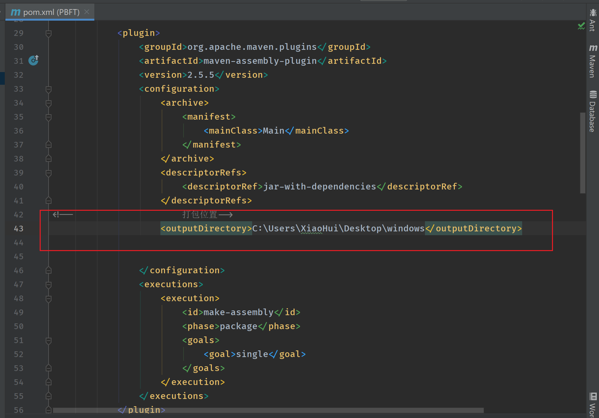
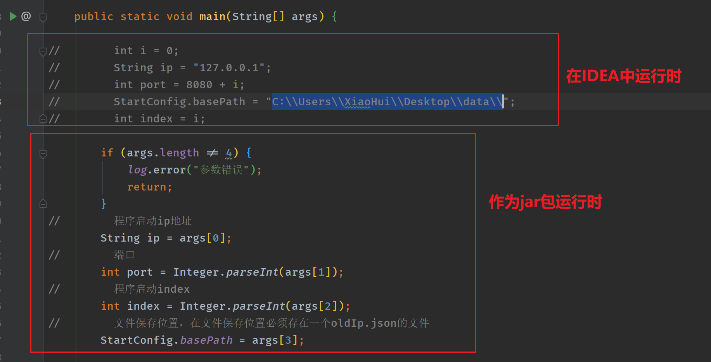
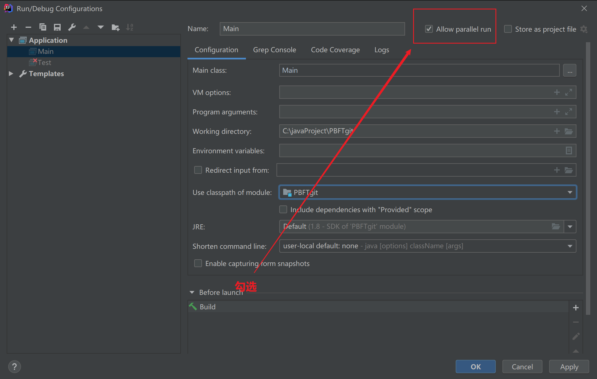
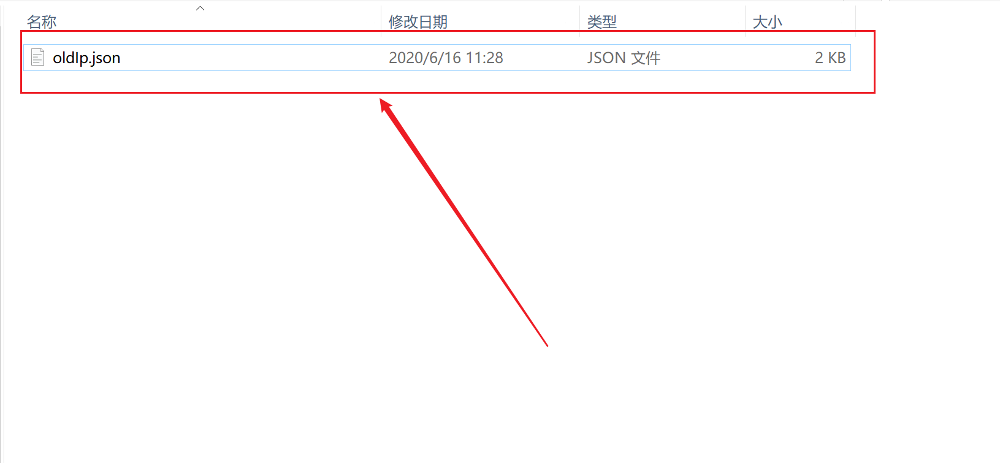

关于代码介绍方法，可以去看我的[博客](https://www.cnblogs.com/xiaohuiduan/category/1635542.html)。里面介绍了一些功能的实现思路和方法，以及使用到的一些库的介绍。

- [PBFT && RBFT算法流程](https://www.cnblogs.com/xiaohuiduan/p/12210891.html)
- [t-io Java构建p2p网络](https://www.cnblogs.com/xiaohuiduan/p/12302024.html)
- [PBFT算法java实现](https://www.cnblogs.com/xiaohuiduan/p/12339955.html)
- [PBFT 算法 java实现（下）](https://www.cnblogs.com/xiaohuiduan/p/12359271.html)


# 使用方法


## 打包

首先在maven中更改jar包生成位置



然后使用命令生成jar包

```bash
mvn package
```

## 运行方法

在IDEA运行着将第二块区域进行注释（第一块区域不要注释），使用jar包运行则将第一块区域进行注释（第二块区域不要注释）



### 包运行方法

```bash
java -jar 包名 ip地址 端口号 序号 文件保存位置
```

- ip地址和端口号代表节点作为server需要占用ip和端口号
- 序号：节点的序号，必须独一无二
- 文件保存位置

例如：

```bash
java -jar oldpbft-jar-with-dependencies.jar 127.0.0.1 8080 0 C:\\Users\\XiaoHui\\Desktop\\data\\
```

因此，你可以在本机上运行多个节点（保证端口号和序号不同即可）。

### 在IDEA中运行的方法

首先配置启动，允许多个main执行



然后，每次启动一个节点，更改 `i` 就可以启动不同的节点。

```java
int i = 0;
String ip = "127.0.0.1";
int port = 8080 + i;
StartConfig.basePath = "C:\\Users\\XiaoHui\\Desktop\\data\\";
int index = i;
```

# 注意点


1. 必须在文件保存的位置中新建一个$oldIp.json$文件，这个文件中保存着节点的ip地址，端口号，序号，公钥，每次启动一个节点的时候，会向这个节点写入自己的信息。

   


2. 如果结束所有节点，然后重新启动程序，需要将$oldIp.json$中的内容全部删除。（比如说你启动了1节点，2节点，然后你关闭了这个程序，又想重新启动1节点2节点就必须删除）


# 完成功能

实际上代码完成的功能很少很少，就是完成了PBFT中的节点加入功能，然后还有消息发送PBFT认证功能，以及交易数据保存的功能。其他的就emm没有做。本人对区块链也不是特别的了解，所以有些功能感觉实现起来的代码怪怪的。

这个仓库代码大概率不会进行更新了，因为emmmmmm，考研去了。